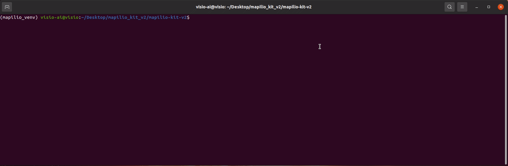

<div align="center">
   <a href="https://mapilio.com/" target="_blank">
   </a>
</div>

<div align="center">
    <a href="https://github.com/mapilio/mapilio-kit-v2/actions/workflows/ci.yml">
      </a>
   <a href="https://github.com/mapilio/mapilio-kit-v2/blob/main/LICENSE">
      </a>
   <a href="https://discord.gg/uhsR97sF">
      </a>
   <a href="https://pypi.org/project/mapilio-kit/">
      </a>
   <a href="https://pypistats.org/packages/mapilio-kit">
      </a>
   <a href="">
      </a>
   <a href="">
      </a>
   <a href="">
      </a>
   <a href="">
      </a>
   <a href="">
      </a>
</div>

# Mapilio Kit

Mapilio Kit is a library for processing and uploading images to [Mapilio](https://www.mapilio.com/).
<!DOCTYPE html>

<h1>Kit Contents</h1>
<ul>
  <li><a href="#introduction">Introduction</a></li>
  <li><a href="#getting-started">Getting Started</a></li>
  <li><a href="#magic-usage">Magic Usage</a></li>
  <li><a href="#advanced-usage">Advanced Usage</a></li>
  <li><a href="https://github.com/mapilio/mapilio-kit-v2/blob/main/CONTRIBUTING.md">Contributing</a></li>
  <li><a href="#license">License</a></li>
  <li><a href="#contact">Contact</a></li>
</ul>

<h1 id="introduction">Introduction</h1>

<p>Our Image Uploader with GPS Metadata is a powerful tool designed to simplify the process of uploading and managing images, while also preserving and utilizing valuable location-based information embedded in photos. With the increasing popularity of geotagging in modern cameras and smartphones, GPS metadata in images can provide valuable context and enhance the user experience. Whether you're a photographer, a traveler, or simply someone who values the story behind each image, our uploader has you covered.

<h1 id="getting-started">Getting Started</h1>

<p>These instructions will help contributors get a copy of your project up and running on their local machine for development and testing purposes.</p>


<ol>
  <li><strong>Prerequisites:</strong>
    <p>To upload images to Mapilio, an account is required and can be created <a href="https://mapilio.com/app?form=register" target="_blank">here</a>. When
    using the kits for the first time, user authentication is required. You will be prompted to enter your account
    credentials.</p>
  </li>
  <li><strong>Installation:</strong>
    <p>To install Mapilio Kit <strong>Pip and <a href="https://www.python.org/downloads/">Python</a> (3.6 and above) is required.</strong> If you have them already, then simply run this command below:</p>
    <pre><code>pip install mapilio_kit</code></pre></li>
    <p><strong>Note:</strong>In case you're using Windows, and if python's path wasn't already added to system environment variables you need to add it right after python installation, to be able to run the packages which are installed with <strong>Pip</strong>. You may do that manually or you may run the command prompt as Administrator and then copy the command below, modify it (according to your python's version and path) and lastly run it. This will be set your python's path automatically after rebooting your computer.</p>
   <pre><code>setx PATH %"PATH%;C:\Users\User\AppData\Local\Packages\Python\Python3XX\Scripts" /M</code></pre>
  <li><strong>Necessary tools:</strong>
    <p>To process images or videos, you will also need to install <code>ffmpeg</code> and <code>exiftool</code>.</p>
    <p>You can download <code>ffmpeg</code> from <a href="https://ffmpeg.org/download.html">here</a>. Make sure it is executable and put the downloaded binaries in your <code>$PATH</code>. You can also install <code>ffmpeg</code> with your favorite package manager. For example:</p>
    <h4>On Windows:</h4>
    <p>Open PowerShell as administrator: (Recommended)</p>
    <pre>Set-ExecutionPolicy Bypass -Scope Process -Force; [System.Net.ServicePointManager]::SecurityProtocol = [System.Net.ServicePointManager]::SecurityProtocol -bor 3072; iex ((New-Object System.Net.WebClient).DownloadString('https://community.chocolatey.org/install.ps1'))
choco install ffmpeg
choco install exiftool</pre>
    <p>or you could follow the <a href="https://www.wikihow.com/Install-FFmpeg-on-Windows">ffmpeg</a> and <a href="https://exiftool.org/install.html#Windows">exiftool</a> installation guides.</p>
    <h4>On macOS, use Homebrew:</h4>
    <pre>
brew install ffmpeg
brew install exiftool
    </pre>
    <h4>On Debian/Ubuntu:</h4>
    <pre>
sudo apt install ffmpeg
sudo apt install exiftool
    </pre></li>
</ol>


<h1 id="magic-usage">Magic Usage</h1>

<p>To use magic usage simply run this command below:</p>
<pre>
<code>mapilio_kit run</code>
</pre>



<!--<details> -->
<!-- <summary> -->
<h1 id="advanced-usage">Advanced Usage</h1>
<!-- </summary> -->

<h3>Getting Started</h3>

<p>These instructions will help contributors get a copy of your project up and running on their local machine for development and testing purposes.</p>

<ol>
  <li><strong>Prerequisites:</strong>
    <p>To upload images to Mapilio, an account is required and can be created <a href="https://mapilio.com/app?form=register" target="_blank">here</a>. When
    using the kits for the first time, user authentication is required. You will be prompted to enter your account
    credentials.</p>
  </li>
  <li><strong>Installation:</strong></li>
<ul>

<li> <p>via Pip on Windows and Python (3.6 and above) and git are required:</p> </li>
<p><strong>Note:</strong> In case you're using <strong></strong>PowerShell<strong></strong> to run these commands below, you need to re-activate virtual env after installation is done, however, if you're using <strong>Command Prompt</strong> you don't need to re-activate it. </p>

<pre><code># Installation commands
git clone https://github.com/mapilio/mapilio-kit-v2.git
cd mapilio-kit-v2
win_installer.cmd
</code></pre>


<li> <p>via Pip on Ubuntu + 18.04 and Python (3.6 and above) and git are required:</p> </li>

<pre><code># Installation commands
git clone https://github.com/mapilio/mapilio-kit-v2.git
cd mapilio-kit-v2
chmod +x install.sh
source ./install.sh
</code></pre>
<li>
<p>via Pip on macOS and Python (3.6 and above) and git are required. In addition, <strong>commands for ubuntu can also be used for macOS</strong>, however, in case using Mac Terminal instead of using iTerm for installation you need to re-activate the virtual env. Otherwise, you're not going to be able to run the kit.</p>
</li><br>
</ul>


<li>
<strong>Necessary tools:</strong>
<p>To process images or videos, you will also need to install <code>ffmpeg</code> and <code>exiftool</code>.</p>

<p>You can download <code>ffmpeg</code> from <a href="https://ffmpeg.org/download.html">here</a>. Make sure it is executable and put the downloaded binaries in your <code>$PATH</code>. You can also install <code>ffmpeg</code> with your favorite package manager. For example:</p>

<h4>On Windows:</h4>
<p>Follow the <a href="https://www.wikihow.com/Install-FFmpeg-on-Windows">ffmpeg</a> and <a href="https://exiftool.org/install.html#Windows">exiftool</a> installation guides.</p>
<p>or</p>
<p>Open PowerShell:</p>
<pre>Set-ExecutionPolicy Bypass -Scope Process -Force; [System.Net.ServicePointManager]::SecurityProtocol = [System.Net.ServicePointManager]::SecurityProtocol -bor 3072; iex ((New-Object System.Net.WebClient).DownloadString('https://community.chocolatey.org/install.ps1'))
choco install ffmpeg
choco install exiftool</pre>

<h4>On macOS, use Homebrew:</h4>
<pre>
brew install ffmpeg
brew install exiftool
</pre>

<h4>On Debian/Ubuntu:</h4>
<pre>
sudo apt install ffmpeg
sudo apt install exiftool
</pre>
</ol>

<h3>User Authentication</h3>

<p>To upload images to mapilio, an account is required and can be created <a href="https://www.mapilio.com/signup" target="_blank">here</a>. When using the tools for the first time, user authentication is required. You will be prompted to enter your account credentials.</p>
<p>Authenticate new user:</p>
<pre><code>mapilio_kit authenticate
</code></pre>
<p>If the user is already authenticated earlier, it will update the credentials in the config:</p>
<pre><code>mapilio_kit authenticate --user_name "mapilio_user_name" --user_email "mapilio_user_email" --user_password "mapilio_user_password"
</code></pre>

<h3>Images upload</h3>

<p>Upload command also works for timelapse images.If you haven't processed your images, please use this command below</p>
<pre><code>mapilio_kit upload "path/to/images" 
</code></pre>

<p>If you have processed your images already, use this one instead</p>
<pre><code>mapilio_kit upload "path/to/images" --processed
</code></pre>

<h3>Video Images upload</h3>
<p>
Video Support Devices: GoPro Hero 9-8-7 Black and 360, and other devices that support GPS metadata.
</p>

<ol>
<li>
Sample GoPro videos in directory path/to/videos/ into import path (must be created before starting)path/to/sample_images/ at a sampling rate 1 seconds, i.e. two frames every second, reading geotag data from the GoPro videos in path/to/videos/
</li>


<pre><code>mapilio_kit video_upload "path/to/videos/" "path/to/sample_images/" \
    --geotag_source "gopro_videos" \
    --interpolate_directions \
    --video_sample_interval 1
</code></pre>
<li> 
Checking path/to/sample_images/ images and mapilio_image_description.json then run under command
</ol>
<pre><code>mapilio_kit video_upload "path/to/sample_images/" --desc_path "mapilio_image_description.json" --processed</code></pre>

### **GoPro Max .360 videos**

#### Must be installed with this method `./max_extractor_install.sh`

1. First, create equirectangular convert script such as below

python script config

- --video-file {video file path}
- --output-folder {output frames path}
- --bin-dir {equirectanguler bin path}

```shell
mapilio_kit gopro360max_process --video-file ~/Desktop/GS017111.360 --output-folder ~/Desktop/OutputData/ --bin-dir bin
```

2. Now we can upload frames

```shell
mapilio_kit upload ~/Desktop/OutputData/frames --user_name="username@mapilio.com" \
                    --geotag_source "gpx" \
                    --geotag_source_path "~Desktop/gps_track.gpx"
```

<h3>Decompose Images</h3>
<p>
The decompose command geotags images in the given directory. It extracts the required and optional metadata from image EXIF (or the other supported geotag sources), and writes all the metadata (or process errors) in an image description file, which will be read during upload.</p>
<pre><code>mapilio_kit decompose "path/to/images" 
</code></pre>


<h3>360 panorama image upload</h3>
<div align="center">
   
</div>
<p>Note that <strong>the heading angle and the center of the image must be overlapped</strong> for calculation purposes. You may see an example above. <strong></strong></p>
<p>
Check the CSV format <a href="https://github.com/mapilio/mapilio-kit-v2/blob/main/schema/panoromic_image_description_shecma.csv">panoramic image description schema.</a>
</p>
<pre><code>mapilio_kit image_and_csv_upload path/to/images --csv_path path/to/test.csv
</code></pre>


<h3>Zip and upload</h3>

<pre><code>mapilio_kit zip  "path/to/images"  "path/to/zipfolder"
mapiio_kit upload "path/to/zipfolder" --proccessed
</code></pre>
<!-- </details> -->

### Docker Support
For docker support please visit; [Docker.md](https://github.com/mapilio/mapilio-kit/blob/main/Docker.md)<br>
For 360 Upload with docker take a look at here; [GoPro360Max.md](https://github.com/mapilio/mapilio-kit/blob/main/GoPro360Max.md)

<h1 id="license">License</h1>

<p>This project is licensed under the MIT LICENSE - see the <code>LICENSE.md</code> file for details.</p>

<h1 id="contact">Contact</h1>

For Mapilio Kit bug reports and feature requests please visit [GitHub Issues](https://github.com/mapilio/mapilio-kit-v2/issues), and join our [Discord](https://discord.com/invite/St5z2sUZ7H) community for questions and discussions!

<br>
<div align="center">
  <a href="https://github.com/mapilio" style="text-decoration:none;">
    </a>
  
  <a href="https://www.linkedin.com/company/mapilio/" style="text-decoration:none;">
    </a>
  
  <a href="https://twitter.com/mapiliocom" style="text-decoration:none;">
    </a>
  
  <a href="https://join.slack.com/t/mapilio/shared_invite/zt-21ocnbsok-Dlr49uKNErAAKMLzGHHvlw" style="text-decoration:none;">
    </a>
  
  <a href="https://discord.com/invite/St5z2sUZ7H" style="text-decoration:none;">
    </a>
</div>
